# Capsule Radar 🛩️

<p align="center">
  <a href="https://selmapi.github.io/capsule-radar/"></a>
  <a href="https://makerworld.com/en/models/2907695-capsule-radar-live-flight-radar-desk-gadget"></a>
  
  
  <a href="LICENSE"></a>
</p>

<p align="center">
  
</p>
<p align="center"><sub>A real flight on the device: callsign, type, altitude/speed, <b>route</b> (Lisbon → Abu Dhabi) and the <b>aircraft photo</b> — all looked up automatically.</sub></p>

A live **ADS-B aircraft radar** for the **Waveshare ESP32-S3-Touch-AMOLED-1.75** — a round 466×466 AMOLED with capacitive touch. It pulls nearby aircraft from a free online feed over WiFi and plots them on a touch radar scope centered on your location, with live flight details and **19 selectable visual themes**.

<p align="center"></p>

## Themes

Long-press the screen to cycle (**right half = next, left half = previous**), or pick one on the web page — your choice is remembered across reboots. All 19 render on the same engine; several add their own touches (Mission Control's starfield, CIC's vector plot, Saber's dual sweep, Browncoat's targeting reticle, LCARS chrome, Reverie's drifting stars).

| | | | | |
|:--:|:--:|:--:|:--:|:--:|
| 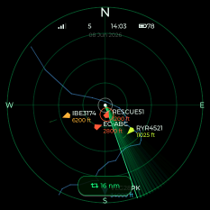<br>**Phosphor** | 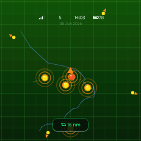<br>**Orb** | 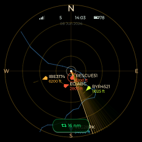<br>**Amber CRT** | 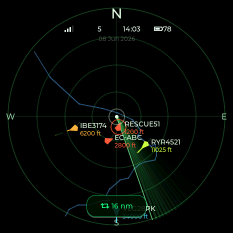<br>**Military** | 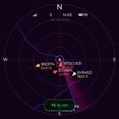<br>**Vice** |
| 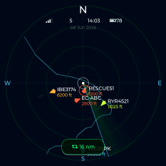<br>**Midnight** | 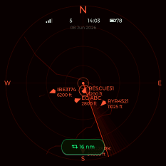<br>**Silent Running** | 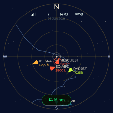<br>**Mission Control** | 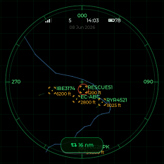<br>**CIC** | 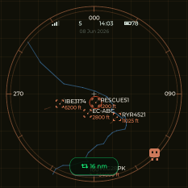<br>**ClaudeIC** |
| 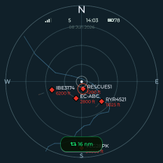<br>**Borderlands** | 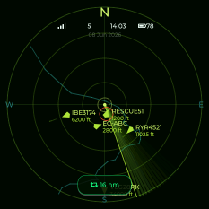<br>**Aliens** | 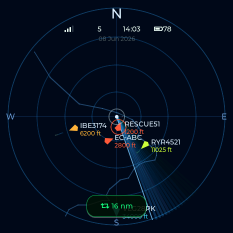<br>**Mass Effect** | 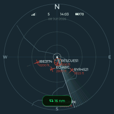<br>**Top Gun** | 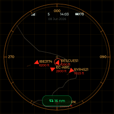<br>**Firefox** |
| 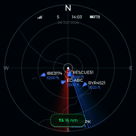<br>**Saber** | 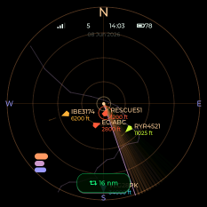<br>**LCARS** | 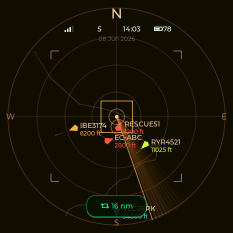<br>**Browncoat** | 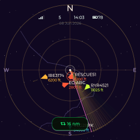<br>**Reverie** | |

<sub>Captured from the bundled desktop simulator (`--themes` mode). The device screen is round; the square corners are off-panel.</sub>

## Features

- **Live traffic** from [airplanes.live](https://airplanes.live) (free, non-commercial; fallback adsb.lol), updated every couple of seconds. Memory-safe streaming parser with a hard aircraft cap.
- **19 themes**, cycled by long-press (right = next, left = back) or the web page, remembered across reboots. Aircraft glyphs rotate by heading and colour-code by altitude, with fading trails, a fade-in on new contacts, and a pulse/red halo on emergencies. Some themes add per-theme flourishes — ATC leader lines, altitude-scaled glyphs, aircraft silhouettes, chevrons, or diamonds.
- **Touch** (CST9217): tap an aircraft → detail card (callsign, type, altitude, vertical speed, ground speed, distance, heading, squawk, and **origin → destination** looked up from adsbdb, cached in NVS). Swipe between **Radar / List / Stats** (circular layouts).
- **Motion gestures** (QMI8658 IMU): **shake to refresh**, **auto-rotate** so the scope stays upright whichever side the USB-C is on, **wake on motion**, and **face-down sleep** (flip it over to blank the screen). Each is toggleable on the web page.
- **Sound & alerts** (ES8311 speaker): a distinct synthesized cue per event — a soft ping for a new contact, a sonar ping for inbound proximity, a low swell for military, a klaxon for emergencies — plus a full-screen red-alert flash. Volume, mute, alert mode and a proximity trigger are on the web page.
- **Airports** on the scope: larger fields as a labelled ring (IATA), smaller ones as a quiet diamond.
- **Smooth motion**: glyphs glide between polls (interpolated) using cheap partial redraws instead of jumping.
- **Top HUD**: WiFi status (amber if the feed is failing), in-range count, NTP/RTC clock, **battery %** (charging bolt, red when low), and the date.
- **Battery aware** (AXP2101): shows charge, warns when low, and slows the feed poll on battery to save power.
- **Real-time clock** (PCF85063): keeps time/date across power loss — the clock is right even before WiFi — re-synced from NTP when online.
- **Smart brightness**: configurable idle auto-dim plus face-down sleep.
- **GPS auto-location** (optional **-G** board with the Quectel LC76G): turn it on and the radar sets its own centre point, with an on-screen satellite icon (amber acquiring, green on fix). Standard boards enter their location manually.
- **Configuration web page** at `http://capsuleradar.local/` — a grouped, collapsible page: **Location & Range · Appearance · Traffic & Filters · Motion · Sound & Alerts · Time & System**. Most settings apply **live** (with a "Saved ✓" confirmation) — theme, brightness, filters, sound, motion, time zone — while only the centre point + range need a restart. Includes a map picker, browser-detected time zone, WiFi reset, and over-the-air firmware update. Everything persists in NVS.
- **First-boot WiFi setup** via a captive portal (`CapsuleRadar-Setup`).

## Hardware

Waveshare **ESP32-S3-Touch-AMOLED-1.75**: ESP32-S3R8 (8 MB PSRAM, 16 MB flash), **CO5300** AMOLED over QSPI, **CST9217** touch, **QMI8658** IMU, **PCF85063** RTC, **AXP2101** PMIC, **ES8311** audio + speaker, microSD. All pins are in [`src/config.h`](src/config.h) (sourced from the board definition; no guessing).

## Flash from your browser (easiest — no toolchain)

Flash without installing anything using **ESP Web Tools** (Chrome or Edge on desktop):

1. Open the **[web flasher](https://selmapi.github.io/capsule-radar/)**.
2. Plug the board in with a USB-C **data** cable and click **Install**.

That's it — on first boot, connect your phone to the **`CapsuleRadar-Setup`** WiFi, enter your home network and your location, and real aircraft appear within seconds. (Erasing on install clears saved WiFi/location, so you'll re-run that one-time setup.)

## Build & flash (PlatformIO)

```bash
pio run -e esp32-s3-amoled-175 -t upload     # build + flash over USB-C
pio device monitor -b 115200                  # serial log
```

On first flash you may need to hold **BOOT** then tap **RESET**. Then follow the same one-time WiFi + location setup as above.

The browser flasher is built and published automatically by GitHub Actions ([`.github/workflows/webflasher.yml`](.github/workflows/webflasher.yml)) on push to `main` (Pages → Source = GitHub Actions). Tagged releases also attach a ready-to-flash `.bin` to a GitHub Release.

## Desktop simulator

The whole UI is portable LVGL and runs on your computer (SDL2) — great for iterating without hardware:

```bash
pio run -e native -t exec           # opens a 466×466 window (needs SDL2: brew install sdl2)
```

Mouse = touch · `T` = cycle theme · close the window to quit.

It also has two headless capture modes (used for this README's gallery):

```bash
.pio/build/native/program --themes docs/img/themes/gal   # one clean shot per theme
.pio/build/native/program --shot   docs/img/shot         # radar / list / stats views
```

## Configuration

Browse to `http://capsuleradar.local/` (or the device IP) on the same WiFi. Change the theme, brightness, filters, sound, motion and time zone and they apply **immediately**; the centre point (map picker) and display range save-and-restart. WiFi reset and OTA firmware update are at the bottom.

## Repo layout

```
src/
  config.h           pins + tunables (Dénia, Spain by default) + FW_VERSION
  main.cpp           tasks, WiFi/NTP, chunked web config page, brightness/IMU glue
  display.*          CO5300 (Arduino_GFX) + LVGL bring-up
  radar_view.*       the radar scope, aircraft, sweep, blip FX
  theme_table.*      the 19 themes (descriptor table)
  ui.*               views (radar/list/stats) + detail card + HUD + touch handlers
  motion.*           IMU gestures (shake / auto-rotate / wake / face-down)
  audio.*            ES8311 alert-sound synthesis
  airports.*         airport markers (ring + IATA / diamond)
  touch_cst9217.*  imu_qmi8658.*  battery.*  rtc_pcf85063.*   device drivers
  adsb_client.*      airplanes.live fetch + parse
  route*.*           origin→destination lookup (adsbdb)
  sim_main.cpp       native SDL simulator (not flashed; --themes / --shot capture)
include/lv_conf.h    LVGL config (v8)
web/flash/           browser web-flasher (ESP Web Tools, self-hosted for locked-down networks)
docs/                hardware / data-source / architecture notes + img/
```

## Credits, data & license

Based on the original **[Capsule Radar](https://github.com/socquique/capsule-radar)** by socquique — this is a personal fork that adds the extra themes, motion gestures, sound, and the redesigned config page. **Firmware / code: [MIT](LICENSE)** — fork and build on it freely (keep the notice). Aircraft data: **airplanes.live** (free, **non-commercial / educational** — exactly this project; be polite with request cadence). Routes: **adsbdb.com** (free). The 3D-printed enclosure is on [MakerWorld](https://makerworld.com/en/models/2907695-capsule-radar-live-flight-radar-desk-gadget).
